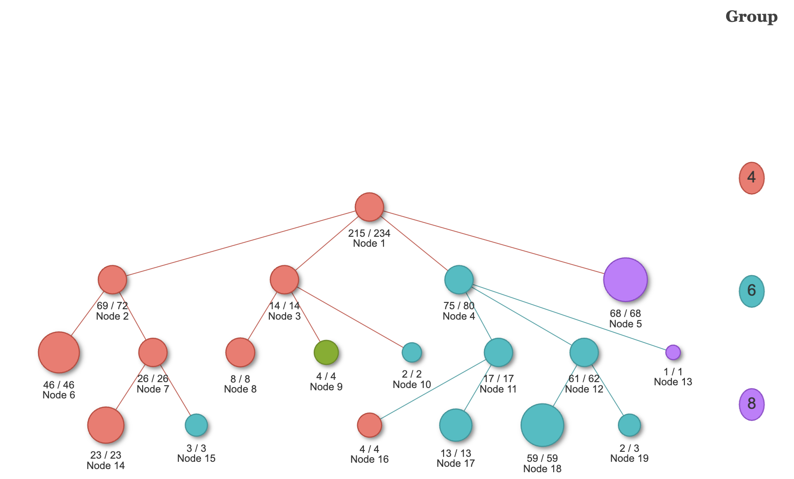
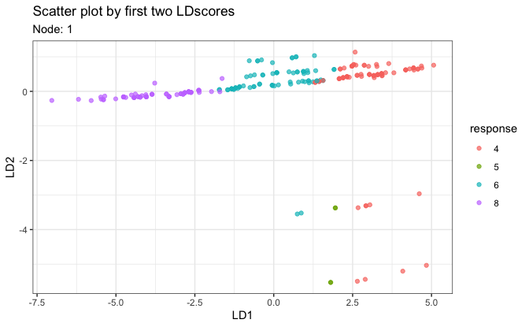
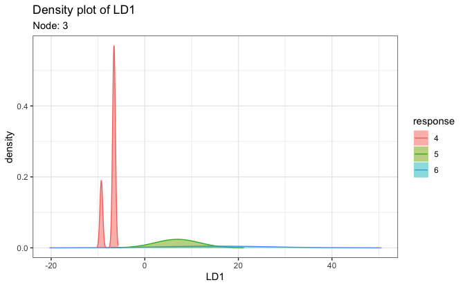

<!-- README.md is generated from README.Rmd. Please edit that file -->

# LDATree <a href="http://iamwangsiyu.com/LDATree/"></a>

<!-- badges: start -->

[](https://CRAN.R-project.org/package=LDATree)
[](https://github.com/Moran79/LDATree/actions/workflows/R-CMD-check.yaml)
<!-- badges: end -->

`LDATree` is an R modeling package for fitting classification trees. If
you are unfamiliar with classification trees, here is a
[tutorial](http://www.sthda.com/english/articles/35-statistical-machine-learning-essentials/141-cart-model-decision-tree-essentials/)
about the traditional CART and its R implementation `rpart`.

## Overview

Compared to other similar trees, `LDATree` sets itself apart in the
following ways:

- It applies the idea of LDA (Linear Discriminant Analysis) when
  selecting variables, finding splits, and fitting models in terminal
  nodes.

- It addresses certain limitations of the R implementation of LDA
  (`MASS::lda`), such as handling missing values, dealing with more
  features than samples, and constant values within groups.

- Re-implement LDA using the Generalized Singular Value Decomposition
  (GSVD), LDATree offers quick response, particularly with large
  datasets.

- The package also includes several visualization tools to provide
  deeper insights into the data.

## Installation

``` r
install.packages("LDATree")
```

## Usage

To build an LDATree:

``` r
library(LDATree)

fit <- Treee(Species~., data = iris)
```

To plot the LDATree:

``` r
# View the overall tree
plot(fit)
```



``` r
# Three types of individual plots
# 1. Scatter plot on first two LD scores
plot(fit, data = iris, node = 1)
```



``` r

# 2. Density plot on the first LD score
plot(fit, data = iris, node = 3)
#> Warning: Groups with fewer than two data points have been dropped.
#> Warning in max(ids, na.rm = TRUE): no non-missing arguments to max; returning
#> -Inf
```



``` r

# 3. A message
plot(fit, data = iris, node = 5)
#> [1] "Every observation in this node is predicted to be virginica"
```

To make predictions:

``` r
# Prediction only.
predictions <- predict(fit, iris)
head(predictions)
#> [1] "setosa" "setosa" "setosa" "setosa" "setosa" "setosa"
```

``` r
# A more informative prediction
predictions <- predict(fit, iris, type = "all")
head(predictions)
#>   response node setosa   versicolor    virginica
#> 1   setosa    7      1 1.346467e-26 5.470122e-41
#> 2   setosa    7      1 3.044310e-22 3.780883e-36
#> 3   setosa    7      1 1.602581e-24 7.965832e-39
#> 4   setosa    7      1 2.066476e-21 1.495780e-34
#> 5   setosa    7      1 3.323135e-27 1.520898e-41
#> 6   setosa    7      1 1.957386e-24 2.347768e-38
```

## Getting help

If you encounter a clear bug, please file an issue with a minimal
reproducible example on
[GitHub](https://github.com/Moran79/LDATree/issues)
