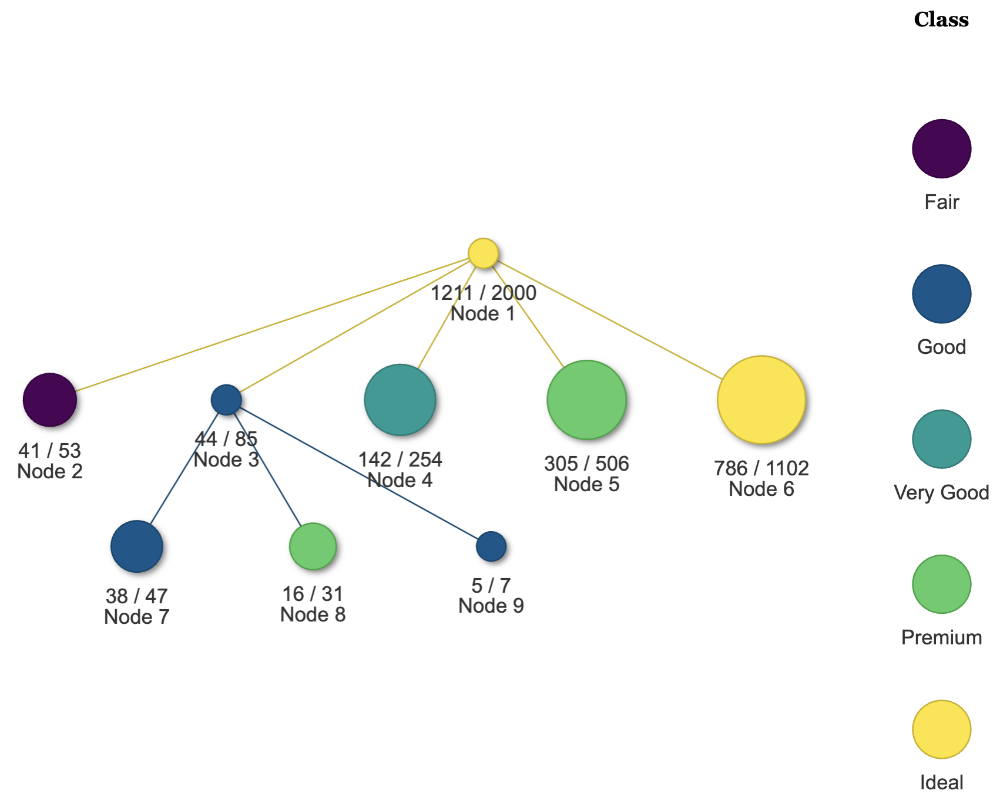
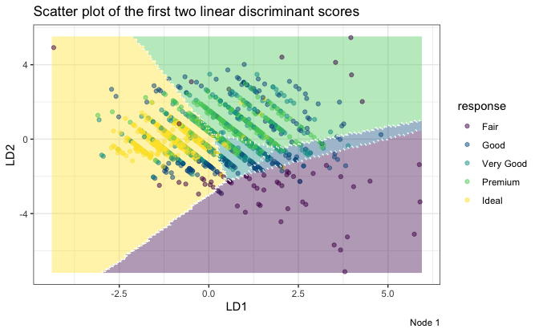
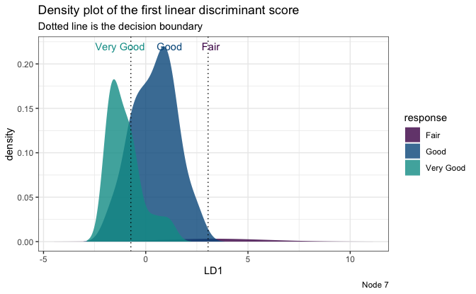

```{r, include = FALSE}
knitr::opts_chunk$set(
  collapse = TRUE,
  comment = "#>"
)
library(LDATree)
```

`LDATree` is an R modeling package for fitting classification trees with oblique splits.

* If you are unfamiliar with classification trees, here is a [tutorial](http://www.sthda.com/english/articles/35-statistical-machine-learning-essentials/141-cart-model-decision-tree-essentials/) about the traditional CART and its R implementation `rpart`.

* More details about the LDATree can be found in Wang, S. (2024). *FoLDTree: A ULDA-Based Decision Tree Framework for Efficient Oblique Splits and Feature Selection*. arXiv preprint arXiv:2410.23147. [Link](https://arxiv.org/abs/2410.23147).


# Why use the `LDATree` package?

Compared to other similar trees, `LDATree` distinguishes itself in the following ways:

* Using Uncorrelated Linear Discriminant Analysis (ULDA) from the `folda` package, it can **efficiently find oblique splits**.

* It provides both ULDA and forward ULDA as the splitting rule and node model. Forward ULDA has intrinsic **variable selection**, which helps mitigate the influence of noise variables.

* It automatically **handles missing values**.

* It can output both predicted class and **class probability**.

* It supports **downsampling**, which can be used to balance classes or accelerate the model fitting process.

* It includes several **visualization** tools to provide deeper insights into the data.


# Basic Usage of `LDATree`

We offer two main tree types in the `LDATree` package: LDATree and FoLDTree. For the splitting rule and node model, LDATree uses ULDA, while FoLDTree uses forward ULDA.

To build an LDATree (or FoLDTree):

```{r,fig.asp=0.618,out.width = "100%",fig.align = "center"}
library(LDATree)
set.seed(443)
diamonds <- as.data.frame(ggplot2::diamonds)[sample(53940, 2000),]
datX <- diamonds[, -2]
response <- diamonds[, 2] # we try to predict "cut"
fit <- Treee(datX = datX, response = response, verbose = FALSE) # by default, it is a pre-stopping FoLDTree
# fit <- Treee(datX = datX, response = response, verbose = FALSE, ldaType = "all", pruneMethod = "post") # if you want to fit a post-pruned LDATree.
```

To plot the LDATree (or FoLDTree):

```{r,fig.asp=0.618,out.width = "80%",fig.align = "center", eval=FALSE}
# View the overall tree.
plot(fit)
```

```{r out.width = '100%',fig.align = "center", echo = FALSE}

```

```{r,echo=TRUE, eval=FALSE}
# Three types of individual plots
# 1. Scatter plot on first two LD scores
plot(fit, datX = datX, response = response, node = 1)
```

```{r, out.width = '100%',fig.align = "center", echo = FALSE}

```

```{r,echo=TRUE, eval=FALSE}
# 2. Density plot on the first LD score
plot(fit, datX = datX, response = response, node = 7)
```

```{r, out.width = '100%',fig.align = "center", echo = FALSE}

```

```{r}
# 3. A message
plot(fit, datX = datX, response = response, node = 2)
```

To make predictions:

```{r,fig.asp=0.618,out.width = "100%",fig.align = "center", echo=TRUE}
# Prediction only.
predictions <- predict(fit, datX)
head(predictions)
```

```{r,fig.asp=0.618,out.width = "100%",fig.align = "center", echo=TRUE}
# A more informative prediction
predictions <- predict(fit, datX, type = "all")
head(predictions)
```


# Additional Features

* **Missing values**: The solution to the missing value problem is inherited from the `folda` package. Check [here](https://iamwangsiyu.com/folda/articles/folda.html#handling-missing-values) for more details.

* **Downsampling**: Optional downsampling occurs only when fitting the ULDA model. Check [here](https://iamwangsiyu.com/folda/articles/folda.html#downsampling) for more details.

* **`misClassCost`**: This parameter is useful in situations where misclassifying certain classes has a more severe impact than others. Check [here](https://iamwangsiyu.com/folda/articles/folda.html#additional-features) for more details.


# References

* Wang, S. (2024). A new forward discriminant analysis framework based on Pillai's trace and ULDA. *arXiv preprint*, arXiv:2409.03136. Retrieved from https://arxiv.org/abs/2409.03136.

* Wang, S. (2024). FoLDTree: A ULDA-based decision tree framework for efficient oblique splits and feature selection. *arXiv preprint*, arXiv:2410.23147. Retrieved from https://arxiv.org/abs/2410.23147.
